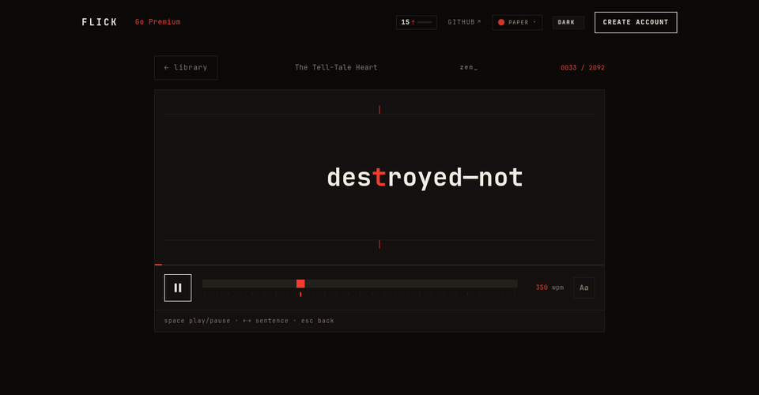
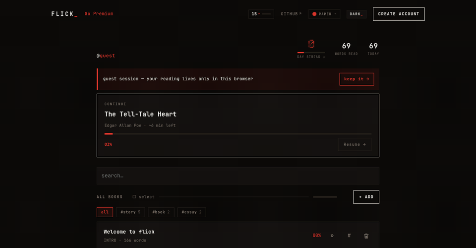

# flick-web

[](https://github.com/one-more-refactor/flick-web/actions/workflows/ci.yml)
[](https://github.com/one-more-refactor/flick-web/releases/latest)
[](https://github.com/one-more-refactor/flick-web/compare)
[](LICENSE)

The web client for [**flick**](https://github.com/one-more-refactor/flick) — Svelte 5 + Vite, built with Bun. A pure client of the [flick API](https://github.com/one-more-refactor/flick-backend); the contract is [`CONTRACTS.md`](https://github.com/one-more-refactor/flick/blob/master/docs/CONTRACTS.md).



- **Reader** — frame-accurate rAF scheduler, fixed ORP pivot, scrubber, WPM control, sentence stepping, context ribbon.
- **Library** — paste, PDF, EPUB, `.txt`, Kindle clippings, or a URL; full-text search; tags; trash with restore.
- **Habit** — streaks, daily goal, stats, a year-in-review "wrapped", friends + shared links.
- **Guest-first** — read with no account; sign up later and your library merges in.
- **Craft** — six themes × light/dark, i18n (en/de/es), installable PWA.



## Design law

Monospace only. Square corners. **One** accent at a time. No gradients, glows, or shadows. Motion is earned (Web Animations API, not a library — the flashy stuff lives in [flick-landing](https://github.com/one-more-refactor/flick-landing)).

## Develop

Needs the [backend](https://github.com/one-more-refactor/flick-backend) on `:8484` (Vite proxies `/api`).

```sh
bun install && bun run dev   # http://localhost:5173
bun run check && bun run build
```

Releases: bump `package.json`, tag `vX.Y.Z`, push the tag — CI verifies the version matches, runs the checks, and publishes the release.

## License

[AGPL-3.0-only](LICENSE).
