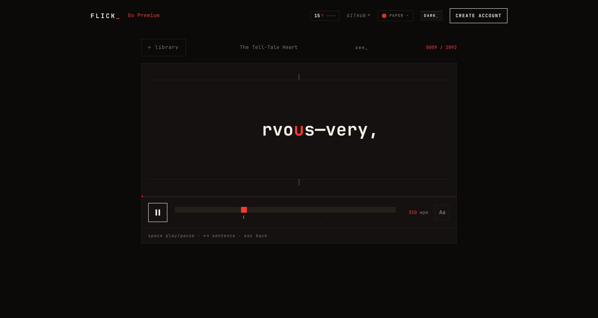

# flick-web

The reference web client for [**flick**](https://github.com/one-more-refactor/flick) — a [Svelte 5](https://svelte.dev) + [Vite](https://vite.dev) single-page app, built with [Bun](https://bun.sh).

It is a pure client of the [flick API](https://github.com/one-more-refactor/flick-backend) — everything it does goes through the endpoints in [`CONTRACTS.md`](https://github.com/one-more-refactor/flick/blob/master/docs/CONTRACTS.md). In production the [backend](https://github.com/one-more-refactor/flick-backend) serves the built output at `/`; in development Vite proxies `/api` to the server.



## What's in here

- **The reader** — the RSVP engine's front-end: a frame-accurate, `requestAnimationFrame`-accumulator scheduler (never `setTimeout`), the ORP pivot rendered fixed, a scrubber, WPM control, sentence stepping, and a context ribbon.
- **The library** — paste, PDF, EPUB, `.txt`, Kindle clippings, or a URL; full-text search; tags; trash with restore. Your position follows you.
- **Habit layer** — day streak, daily goal, reading stats, a year-in-review "wrapped", and a light social layer (friends, shared links).
- **Guest-first** — start reading with no account; sign up later and your library merges in.
- **Craft** — three themes, one switchable accent, i18n (English, German, Spanish), installable PWA.


## Design law

This client follows a deliberately strict house style (see [CONTRACTS.md](https://github.com/one-more-refactor/flick/blob/master/docs/CONTRACTS.md)):

- **Monospace only.** Square corners. **One** accent colour at a time.
- **No gradients, glows, drop-shadows, or scanline gimmicks.**
- **Motion is earned** — the Web Animations API and `IntersectionObserver`, not a heavy animation library. (The flashy marketing motion lives in [flick-landing](https://github.com/one-more-refactor/flick-landing), which is not part of this AGPL client.)

## Develop

Needs the [backend](https://github.com/one-more-refactor/flick-backend) running on `:8484` (Vite proxies `/api` to it).

```sh
bun install
bun run dev        # http://localhost:5173
```

```sh
bun run check      # svelte-check + tsc
bun run build      # → dist/   (served by flick-server)
```

## License

[AGPL-3.0-only](LICENSE).
