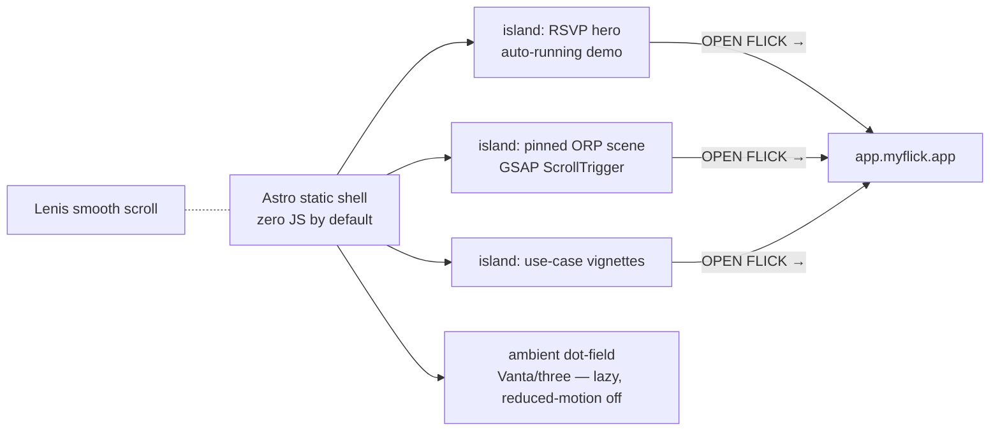

# landing

[](LICENSE)

The marketing site for [**flick**](https://github.com/one-more-refactor/flick) at **[myflick.app](https://myflick.app)** — formerly the separate flick-landing repo, now the `landing/` workspace of flick-web. It owns the site root; the app is served under `/app/` from the same build.


## Stack

**[Astro](https://astro.build)** (static, zero JS by default) with interactive islands: the auto-running RSVP hero, a pinned ORP scroll scene, use-case vignettes. Motion: **GSAP** · **Lenis** · **anime.js** · **Vanta**/three.js (lazy, theme-synced, off under `prefers-reduced-motion`).

> Those libraries are why this repo is separate and **MIT**: some are not GPL-compatible, so they stay out of the AGPL app. The app's own motion is Web Animations API only.

## How it's shaped



## Brand

Design tokens ported from the app (`src/styles/tokens.css`): monospace, square corners, one `--accent`, light/dark read from `flick.mode`/`flick.theme` before first paint. CTA targets live in `src/config.ts`.

## Develop / Deploy

```sh
bun install                   # once, at the repo root (workspaces)
bun run dev:landing           # from the root — http://localhost:4321
bun run build                 # from the root — landing into dist/, app into dist/app/
```

No separate deployment: the flick-backend image serves the combined `dist/` — the landing at `/`, the SPA at `/app/`. The old nginx container and quadlet unit are retired.

## License

[MIT](LICENSE) — this site only. The flick app is [AGPL-3.0](https://github.com/one-more-refactor/flick/blob/master/LICENSE). Bundled libraries carry their own licenses.
